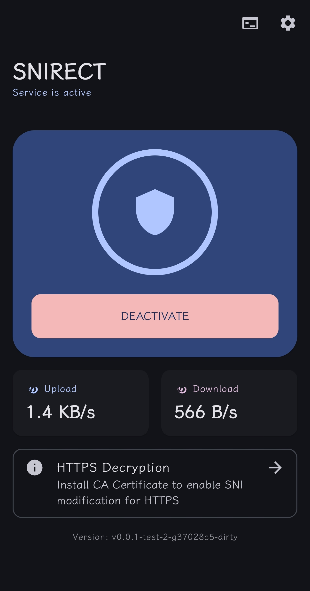
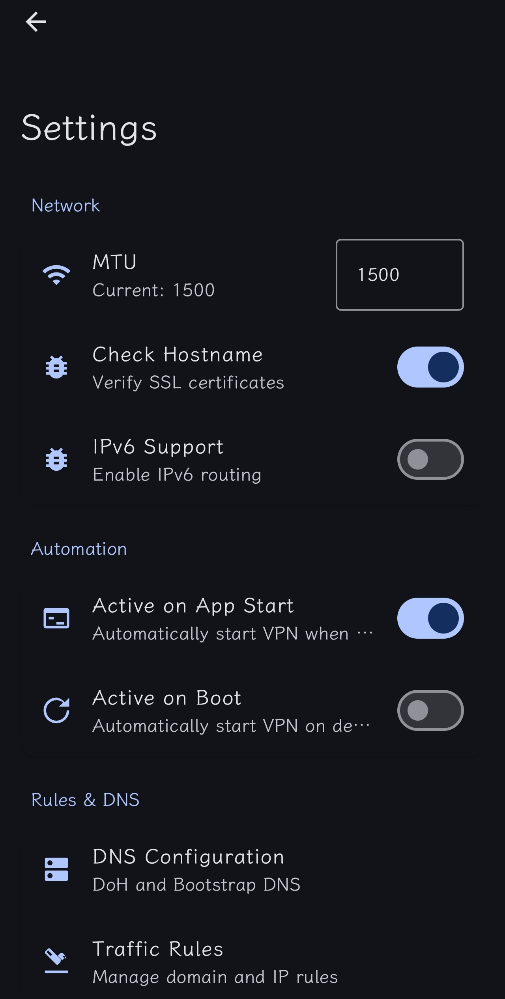
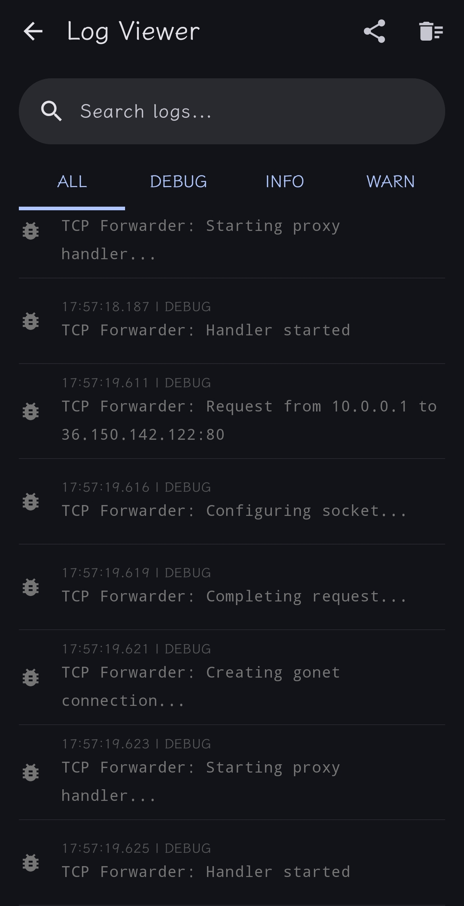

# Snirect Android

基于 Go (gVisor) + Kotlin 的 Android 流量拦截与 SNI 修改工具。

## 预览

| 主界面 | 设置 | 日志 |
| :---: | :---: | :---: |
|  |  |  |

## 使用向导

> [!IMPORTANT]
> **必须先安装 CA 证书**：为了确保 HTTPS 流量（如 Pixiv 等）能够正常拦截和修改 SNI，请务必先按照下方的 [CA 证书安装指南](#ca-证书安装指南) 完成证书安装。

1.  **启动服务**:
    *   在主界面点击 **ACTIVATE** 按钮。
    *   如果是首次运行，请授权 VPN 权限。
    *   状态显示为 "Service is active" 时，流量已开始拦截。
2.  **查看日志**:
    *   点击右上角的终端图标进入日志界面，实时查看流量拦截与修改详情。
3.  **高级配置**:
    *   进入 **Settings** 界面可以配置自定义 DNS (DoH)、修改 MTU、开启 IPv6 以及管理流量过滤规则。

## CA 证书安装指南

为了支持 HTTPS 解密和 SNI 修改，您需要手动安装本应用生成的 CA 根证书。

### 1. 导出证书
*   在主界面点击底部的 **HTTPS Decryption** 卡片。
*   证书文件 `snirect_ca.crt` 将自动导出并保存到您的设备 **Downloads (下载)** 目录。
*   应用会自动为您跳转至系统安全设置页面。

### 2. 手动安装 (Android 11+)
由于 Android 系统的安全限制，您必须在设置中手动寻找安装入口：

1.  打开系统 **设置 (Settings)** -> **安全 (Security)** (部分系统在 **安全与隐私** -> **更多安全设置**)。
2.  找到 **加密与凭据 (Encryption & credentials)**。
3.  选择 **安装证书 (Install a certificate)**。
4.  选择 **CA 证书 (CA certificate)**。
5.  系统会弹出安全警告，点击 **仍然安装 (Install anyway)**。
6.  在文件选择器中找到并选择您刚刚导出的 `snirect_ca.crt` 文件。
7.  验证安装成功：在“信任的凭据”中查看“用户”选项卡，应能看到 Snirect 相关的证书。

### 3. 针对开发者 (Android 7.0+)
如果您是开发者，希望自己的 App 信任此证书，需在项目中添加 `network_security_config.xml`：

```xml
<network-security-config>
    <base-config>
        <trust-anchors>
            <certificates src="system" />
            <certificates src="user" />
        </trust-anchors>
    </base-config>
</network-security-config>
```

**注意**: 若不安装证书，拦截 HTTPS 流量时会导致客户端报错（证书风险）。

## 项目结构

*   `android/`: Android 宿主工程 (Kotlin + Jetpack Compose)。
*   `core/`: Go 核心逻辑 (gVisor 网络栈 + SNI 逻辑)。

## 开发环境准备

1.  **Go**: 1.20+
2.  **Android Studio**: Hedgehog 或更新版本
3.  **Android NDK**: 推荐 26.x 或更高
4.  **gomobile**: 用于编译 Go 核心库

## 构建步骤

### 1. 编译核心库 (AAR)

由于 `gomobile` 在某些 CLI 环境下的依赖解析问题，建议在本地完整的 Shell 环境中执行：

```bash
# 安装 gomobile 工具
go install golang.org/x/mobile/cmd/gomobile@latest
gomobile init

# 进入核心目录
cd core

# 编译 AAR (确保已设置 ANDROID_HOME 和 ANDROID_NDK_HOME)
# 示例：
# export ANDROID_HOME=$HOME/Android/Sdk
# export ANDROID_NDK_HOME=$ANDROID_HOME/ndk/26.1.10909125
gomobile bind -v -target=android -androidapi 21 -o ../android/app/libs/core.aar .
```

成功后，你应该在 `android/app/libs/` 下看到 `core.aar` 文件。

### 2. 运行 Android 应用

1.  用 Android Studio 打开 `android/` 目录。
2.  同步 Gradle。
3.  连接 Android 设备或模拟器。
4.  点击运行。

**注意**: 必须先完成步骤 1 生成 AAR，否则 Android 项目会因为找不到 `core.Core` 类而报错。

## 功能特性

*   **VPNService**: 接管系统流量。
*   **Transparent Proxy**: 使用 gVisor netstack 在用户态还原 TCP 流。
*   **SNI Modification**: 解析并修改 TLS ClientHello 中的 SNI 扩展。

## 故障排除

*   如果 `gomobile bind` 报错 `no Go package in golang.org/x/mobile/bind`：
    *   尝试 `go get -d golang.org/x/mobile/bind`。
    *   确保你的 `GOPATH` 设置正确。
*   如果 Android 编译报错 `Unresolved reference: core`：
    *   检查 `android/app/libs/core.aar` 是否存在。
    *   检查 `android/app/build.gradle` 中是否包含 `implementation fileTree(dir: 'libs', include: ['*.aar'])`。
